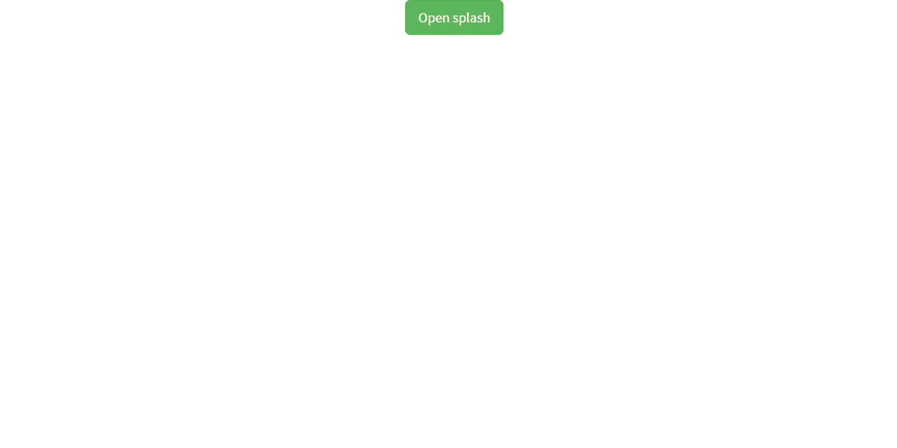
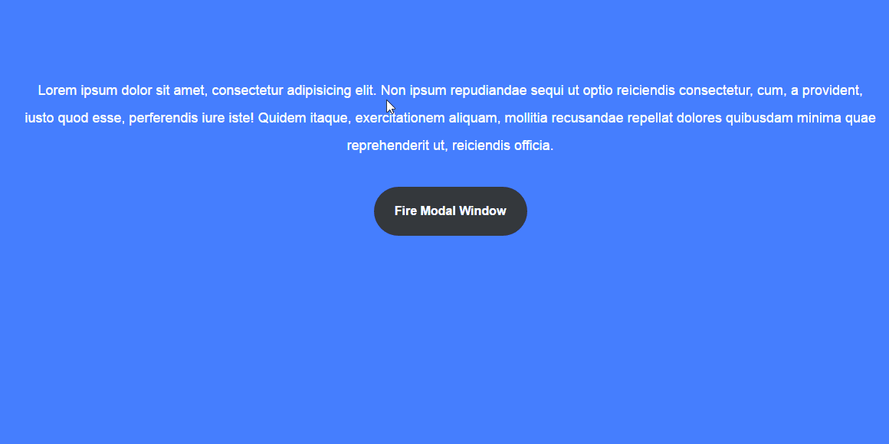
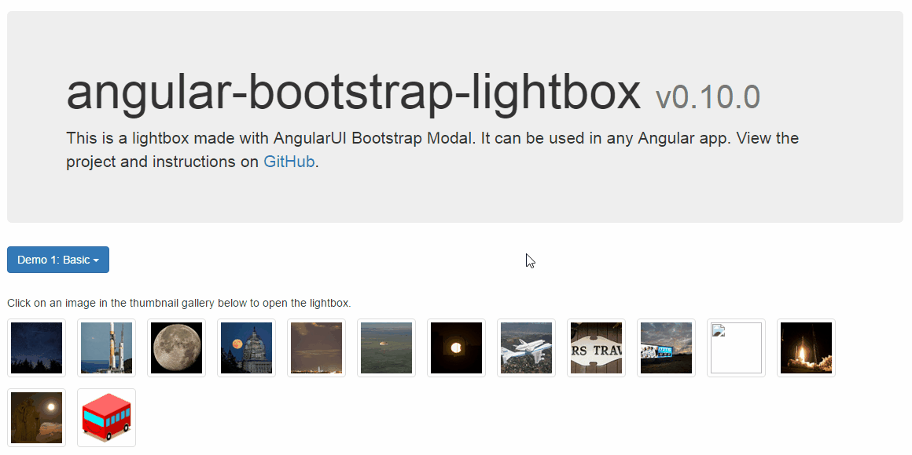
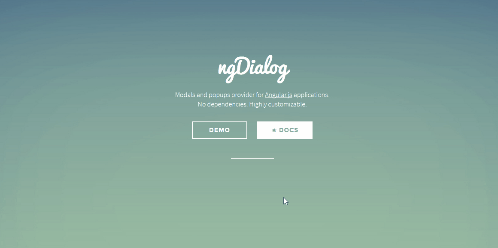
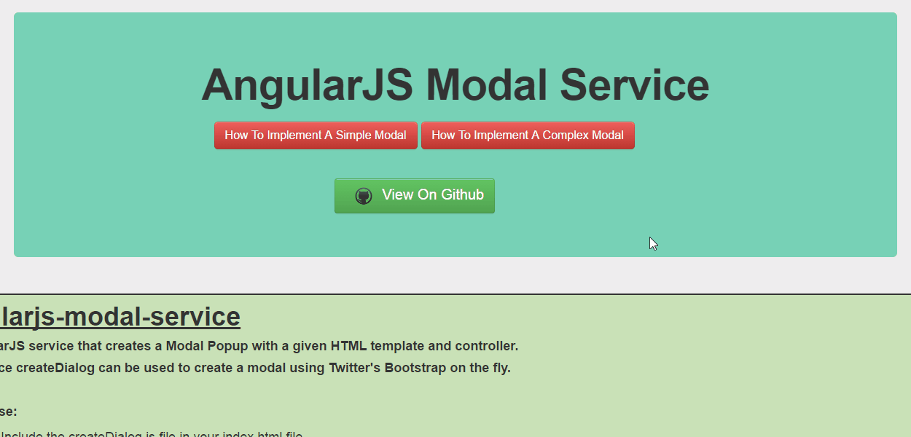
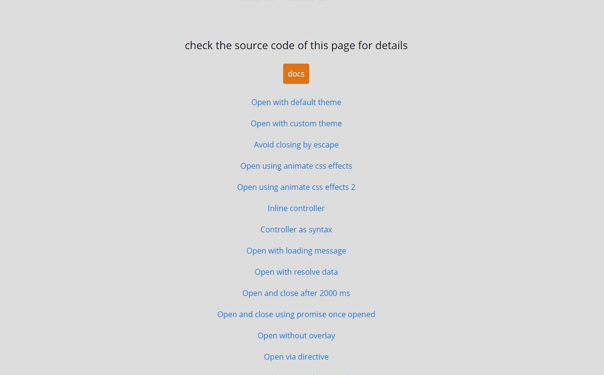

# Angular Modal Dialog Collection

### 1. Splash modal service

A simple AngularJS service for displaying a full screen splash modal.

[Demo](http://popdevelop.github.io/angular-splash-demo/)/[Github](https://github.com/popdevelop/angular-splash-demo)

### 2. Morphing Modal

Angular directive for fullscreen modal window with wonderful animation in trending Material Design style. Responsive and mobile-ready. Works in modern browsers.

[Demo](https://dl.dropboxusercontent.com/u/60349134/ngm/example/index.html#)/[Github](https://github.com/shauchenka/ng-morphing-modal)

### 3. bootstrap-lightbox

This lightbox displays images using an AngularUI Bootstrap Modal (v0.14).
When the lightbox is opened, navigating to the previous/next image can be achieved by clicking buttons above the image, clicking the left/right arrow keys, or swiping to the left/right (optional with ngTouch). The escape key for closing the modal is automatically binded by AngularUI Bootstrap.
Large images are scaled to fit inside the window. An optional image caption overlays the top left corner of the image.

[Demo](http://compact.github.io/angular-bootstrap-lightbox/demo1/index.html)/[Github](https://github.com/compact/angular-bootstrap-lightbox)

### 4. ngDialog

Modal dialogs and popups provider for AngularJS applications.
ngDialog is ~10KB (minified), has minimalistic API, is highly customizable through themes and has only AngularJS as dependency.

[Demo](http://likeastore.github.io/ngDialog/#)/[Github](https://github.com/likeastore/ngDialog)

### 5. AngularJS Modal Service

An AngularJS service that creates a Modal Popup with a given HTML template and controller.
The Service createDialog can be used to create a modal using Twitter's Bootstrap on the fly.

[Demo](http://fundoo-solutions.github.io/angularjs-modal-service/)/[Github](https://github.com/Fundoo-Solutions/angularjs-modal-service)

### 6. fancy-modal

The definitive modal/popup/dialog solution for AngularJS. Modal dialogs and popups for Angular.js (>=1.2.x) applications. Mobile friendly out of the box.

[Demo](http://vesparny.github.io/angular-fancy-modal/example/)/[Github](https://github.com/vesparny/angular-fancy-modal)